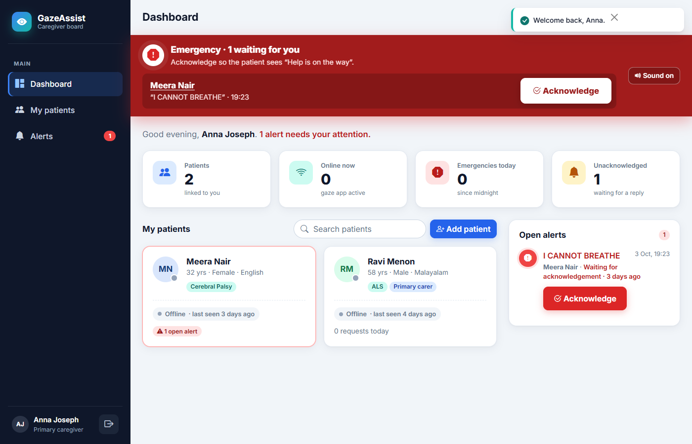
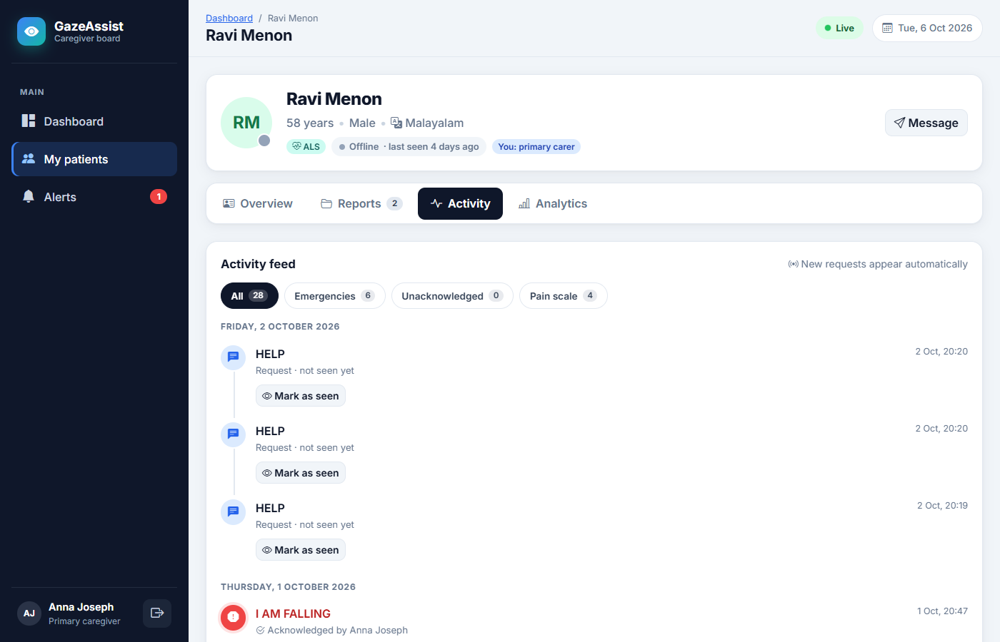
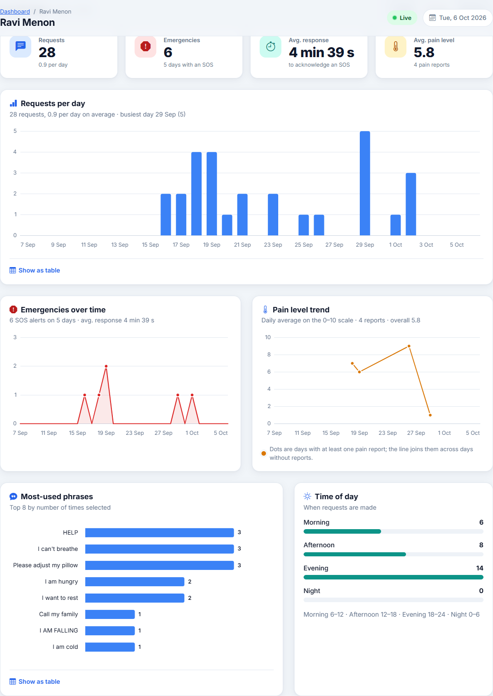
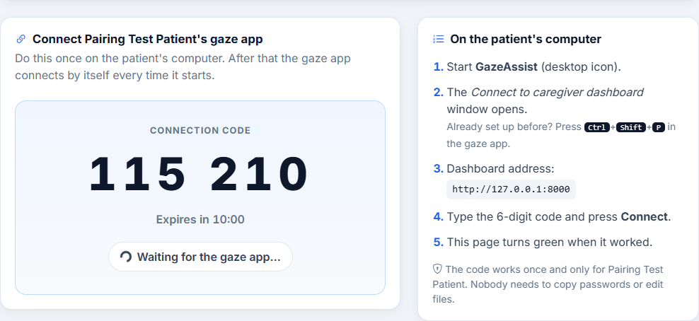
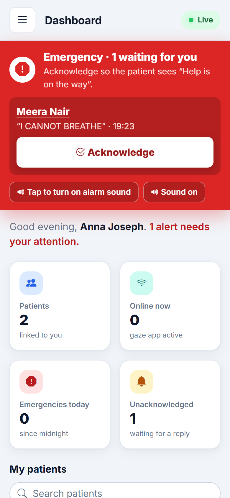
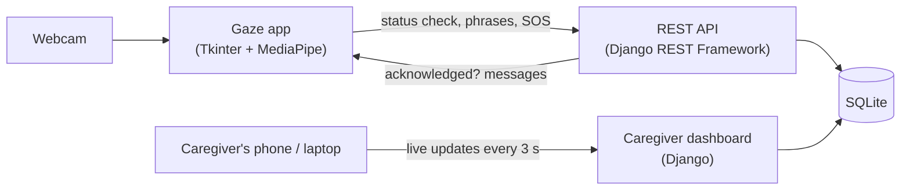

# GazeAssist

**An eye-gaze communication system for people who cannot speak or move, with a real-time web dashboard for their caregivers.**

People living with ALS, stroke, cerebral palsy, spinal cord injury or locked-in syndrome often keep control of only their eyes. GazeAssist turns an ordinary laptop webcam into a communication aid: the patient looks at a phrase and blinks to say it out loud, or calls for help. Caregivers see every request, SOS alert and message on a dashboard on their phone or laptop.

No special hardware: a standard webcam, no eye-tracker and no GPU.



---

## Contents

- [Features](#features)
- [Screenshots](#screenshots)
- [How it works](#how-it-works)
- [Tech stack](#tech-stack)
- [Project structure](#project-structure)
- [Getting started](#getting-started)
- [Connecting the gaze app to a patient](#connecting-the-gaze-app-to-a-patient)
- [REST API](#rest-api)
- [Security and privacy](#security-and-privacy)
- [Tests](#tests)
- [Limitations](#limitations)

---

## Features

### For the patient: gaze app (`gazeassist/`)

- **Gaze tracking with a webcam.** MediaPipe Face Mesh with a 6-point calibration, One-Euro filter smoothing and zone hysteresis, so the selection doesn't jitter between tiles.
- **Select with your eyes.** Look at a tile to arm it, then use a long blink to confirm. This two-step design prevents accidental selections.
- **Phrase board** with food, water, bathroom, help, medical and social phrases. Frequently used phrases move to the front.
- **Pain scale** from 1 to 10, selected the same way.
- **Speech output** in Hindi, Malayalam, Tamil and Telugu (edge-tts, with an offline fallback).
- **Emergency SOS.** A local alarm, WhatsApp and SMS alerts, and a red alert on every caregiver's dashboard.
- **Messages from caregivers** appear in large text on the patient's screen and are read aloud.

### For caregivers: web dashboard (`gazeassist_web/`)

- **Live overview.** Patient cards with online/offline status, open alerts and today's requests, updated every 3 seconds without reloading.
- **SOS flow.** A flashing red banner with an alarm sound appears on every page. One tap on **Acknowledge** makes the patient's screen say *"Help is on the way"*.
- **Patient pages** with tabs:
  - **Overview:** profile, condition and care team.
  - **Reports:** upload, view, download and delete medical reports.
  - **Activity:** a live timeline.
  - **Analytics:** charts.
- **Analytics:** requests per day, emergencies over time, pain-level trend and most-used phrases (Chart.js), each with a table view.
- **Messages to the patient,** with quick replies.
- **Add patients and connect their gaze app** with a one-time 6-digit code. Nobody has to copy passwords or edit files.
- **Accounts:** caregiver self-registration with optional admin approval, and an admin panel with search and filters.
- **Responsive and accessible design,** usable on a phone.

### No terminal needed

- **`run_all.py`** starts the dashboard and the gaze app together and shuts both down cleanly.
- **`setup_shortcuts.py`** creates a **GazeAssist** desktop icon. It can also start the system at Windows login, with no console windows.

---

## Screenshots

| Patient activity (live) | Analytics |
|---|---|
|  |  |

| Connecting a gaze app with a one-time code | Phone view |
|---|---|
|  |  |

*All names in the screenshots are demo data.*

---

## How it works



1. Every 5 seconds the gaze app sends a short **status check** ("the app is running"). The patient shows as *Online* if one arrived within the last 15 seconds. This is not the patient's heart rate; GazeAssist has no medical sensors.
2. Each selected phrase, pain level or SOS is sent to the API. If the dashboard can't be reached, it waits in a queue, and an SOS always goes first.
3. Caregiver pages poll the server every 3 seconds and update without reloading.
4. When a caregiver acknowledges an SOS, the gaze app's next status check returns *"Help is on the way"*, and the app shows and speaks it.

All network calls in the gaze app run on a background thread, so eye tracking never freezes.

---

## Tech stack

| Area | Technologies |
|---|---|
| Gaze app | Python 3.11, Tkinter, MediaPipe, OpenCV, NumPy, edge-tts / pyttsx3, pygame |
| Dashboard | Django 5, Django REST Framework (token auth), SQLite |
| Frontend | Bootstrap 5, Bootstrap Icons, vanilla JavaScript (fetch), Chart.js 4 |
| Alerts | Meta WhatsApp Cloud API, Fast2SMS |
| Security | DRF token auth, one-time pairing codes (HMAC), Windows DPAPI, CSRF, rate limiting |
| Testing | Django test framework, unittest, Playwright (end-to-end checks) |

---

## Project structure

```
MiniProject/
├── gazeassist/              Patient gaze app (Tkinter)
│   ├── main.py              Entry point
│   ├── perception/          MediaPipe face mesh
│   ├── gaze/                Calibration, gaze model, smoothing
│   ├── blink/               Eye-aspect-ratio blink detection
│   ├── phrase_board/        Tiles, dwell + blink selection
│   ├── pain_scale/          Pain scale screen
│   ├── sos/                 Alarm, WhatsApp and SMS alerts
│   ├── tts/                 Multilingual text-to-speech
│   ├── caregiver_link.py    Connection to the web dashboard
│   └── test_*.py            Unit tests
├── gazeassist_web/          Caregiver dashboard (Django)
│   ├── board/               App: models, views, live updates, pairing
│   │   └── api/             REST API used by the gaze app
│   ├── templates/           Pages and reusable partials
│   └── static/              CSS and JavaScript
├── run_all.py               Start everything with one command
├── setup_shortcuts.py       Desktop icon / start at login (Windows)
└── assets/                  Icon
```

---

## Getting started

Tested on **Windows 11 with Python 3.11**. The gaze app needs a webcam.

### 1. Clone

```powershell
git clone https://github.com/Fathimaka04/MiniProject.git
cd MiniProject
```

### 2. Set up the dashboard

```powershell
cd gazeassist_web
python -m venv .venv
.\.venv\Scripts\Activate.ps1
pip install -r requirements.txt

Copy-Item .env.example .env
python -c "from django.core.management.utils import get_random_secret_key; print(get_random_secret_key())"
# paste the printed key into .env as SECRET_KEY=...

python manage.py migrate
python manage.py createsuperuser     # admin account
python manage.py seed_demo           # optional: demo caregiver, patients and data
deactivate
cd ..
```

### 3. Set up the gaze app

```powershell
python -m venv .venv
.\.venv\Scripts\Activate.ps1
pip install -r gazeassist\requirements.txt
Copy-Item gazeassist\.env.example gazeassist\.env    # optional: WhatsApp / SMS keys
```

### 4. Run

```powershell
python run_all.py
```

The dashboard starts at **http://127.0.0.1:8000/**, followed by the gaze app window. Close the gaze app window (or press Ctrl+C) to stop both.

With `seed_demo`, sign in as **demo_caregiver** / **Demo@12345**.

**Without a terminal:** run `python setup_shortcuts.py` once to get a **GazeAssist** icon on the desktop. Add `--autostart` to start it when Windows logs in.

<details>
<summary>Running the two programs separately</summary>

```powershell
# Terminal 1: dashboard
cd gazeassist_web
.\.venv\Scripts\Activate.ps1
python manage.py runserver

# Terminal 2: gaze app
.\.venv\Scripts\Activate.ps1
cd gazeassist
python main.py
```
</details>

---

## Connecting the gaze app to a patient

1. In the dashboard, click **Add patient** (or open an existing patient).
2. On the patient's page, click **Connect gaze app**, then **Create connection code**.
3. On the patient's computer, the gaze app asks for the code the first time it starts (or press **Ctrl+Shift+P**). Type the 6-digit code and press **Connect**.
4. The dashboard page turns green. From then on, the gaze app connects by itself.

---

## REST API

Used by the gaze app. Every call except `pair` needs `Authorization: Token <token>`.

| Method | Endpoint | Purpose |
|---|---|---|
| POST | `/api/pair/` | Swap a one-time code for the patient's token |
| POST | `/api/heartbeat/` | Status check: the gaze app is running, so the patient shows *Online* (not the patient's heart rate) |
| POST | `/api/requests/` | Send a phrase, pain level or SOS: `{"phrase", "is_emergency", "pain_level"}` |
| GET | `/api/requests/<id>/status/` | Has a caregiver acknowledged it? |
| GET | `/api/messages/pending/` | Caregiver messages not yet shown |

Each token can only reach its own patient's data.

---

## Security and privacy

- **Caregivers** sign in with hashed passwords. Every page, file and API call checks that the caregiver is linked to that patient; anything else returns *404 Not Found*.
- **The gaze app** proves which patient it serves with a token. A token can only access its own patient's data, and a caregiver's browser session can't use the gaze API.
- **Pairing codes** work once, expire after 10 minutes, and are stored only as an HMAC hash. Guesses are rate-limited.
- **On the patient's computer,** the token is stored encrypted with Windows DPAPI. Only that Windows user can read it.
- **Medical reports** are stored outside the public static folder under random names. They're checked by extension, content type and file signature (PDF, PNG and JPG only, up to 5 MB), and are served only after the access check.
- **Forms** are protected against CSRF, and secrets are kept in `.env` files, which are never committed.

---

## Tests

```powershell
# Dashboard: 79 tests (access control, API, SOS flow, pairing, analytics)
cd gazeassist_web
.\.venv\Scripts\Activate.ps1
python manage.py test board

# Gaze app: 28 tests (selection logic, dashboard link, pairing); no camera needed
cd ..\gazeassist
..\.venv\Scripts\Activate.ps1
python -m unittest test_selection_confirm test_caregiver_link test_pairing_link
```

---

## Limitations

- The dashboard runs on Django's development server and SQLite. A real deployment would need a production server (e.g. Gunicorn or Waitress), HTTPS and PostgreSQL.
- The desktop shortcut, encrypted token storage and launcher clean-up are Windows-specific. The core apps are plain Python.
- Gaze accuracy depends on lighting, camera position and calibration.

---

## Author

**Fathima K A**: [github.com/Fathimaka04](https://github.com/Fathimaka04)
